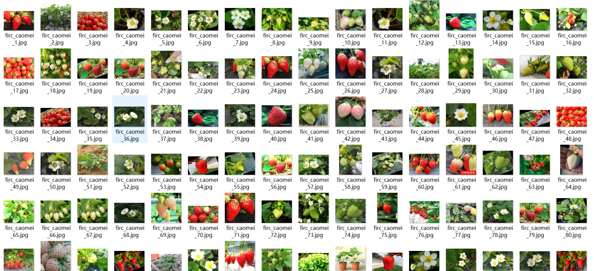
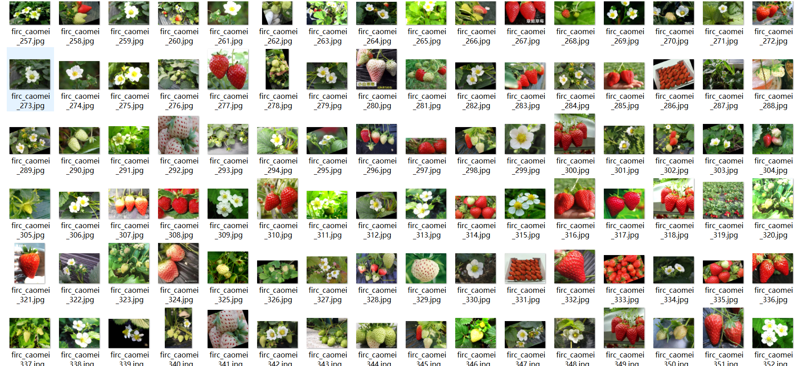

# [Object Detection] Strawberry Ripeness the Detection Dataset VOC+YOLO format412 images3-class

Dataset Description:

Dataset format: Pascal VOC format + YOLO format (the txt file does not contain the split path, it only contains jpg images and corresponding VOC format xml files and yolo format txt files)

Number of images (Total number of jpg files): 412

Number of xml files: 412

Number of txt files: 412

Number of annotated categories: 3

Annotation class names: ["flower","growth","mature"]

Number of boxes labeled in each category:

flower frame count = 410

growth frame count = 671

mature frame count = 851

Total boxes: 1932

Use the labeling tool: labelImg

## Images

---

Here is a pay link on Stripe (https://buy.stripe.com/3cs8yP7sY87d0vu9AB). Please contact me lonlonago@foxmail.com after funding $89, and I will send you a complete data files, thank you!

